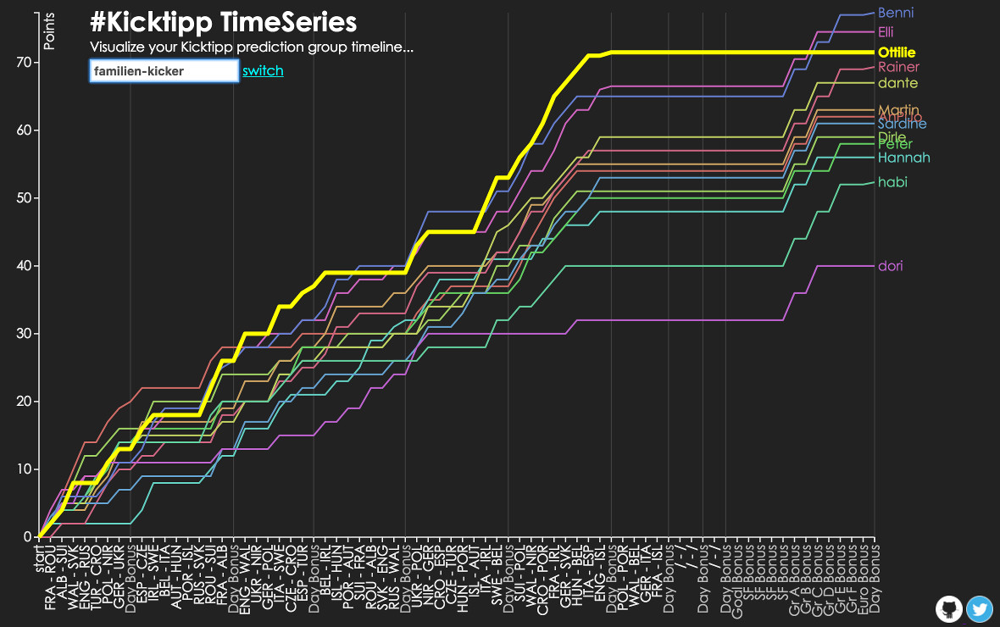
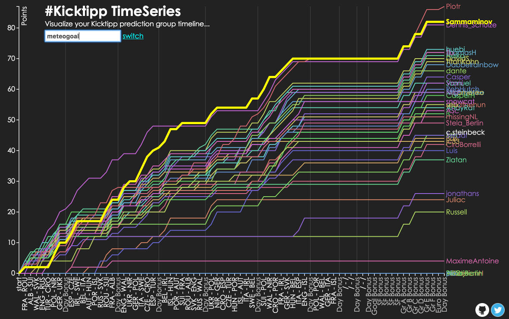

 

_work in progress..._

bug reports, feature requests, contribution appreciated :)

# Kicktipp Timeseries

Interactive time series visualization of [Kicktipp](http://kicktipp.com/) football prediction group members

## build & start

1. build: `mvn package`
2. run: `java -jar target/kicktipp-timeseries*.jar`
3. access: `http://localhost:8080`