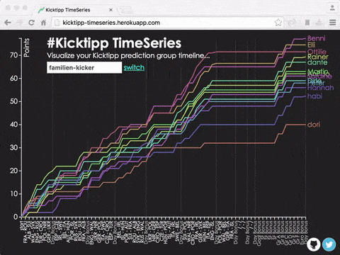

 

_work in progress..._

feedback, bug reports, feature requests, contribution much appreciated :)

# Kicktipp TimeSeries

This is an interactive time series visualization for [Kicktipp](http://kicktipp.com/) football prediction groups. 
Motivation behind ist that I would like to recap all the tight moments :grimacing: with all the personal highs :chart_with_upwards_trend: and lows :chart_with_downwards_trend: during the prediction phase.

It is tested with prediction groups of :soccer: EURO2016 :soccer: Bundesliga (15/16).   

## build & start

1. build: `mvn package`
2. run: `java -jar target/kicktipp-timeseries*.jar`
3. access: `http://localhost:8080`

## background

[JSOUP in Action](https://jsoup.org/) :tada: because [Kicktipp](http://kicktipp.com/) doesn't offer any API. But please don't worry: data gets cached for 60 minutes so their servers are not getting stressed :fire: by this little service. :v:

No personal data is getting stored. Just for application controlling reasons the requested prediction group name plus request time are getting logged.

## roadmap

1. (2016) point/position switch
2. (2016) dynamic bonus points + upgrade on D3v4
3. (2017) adopt F1 prediction groups